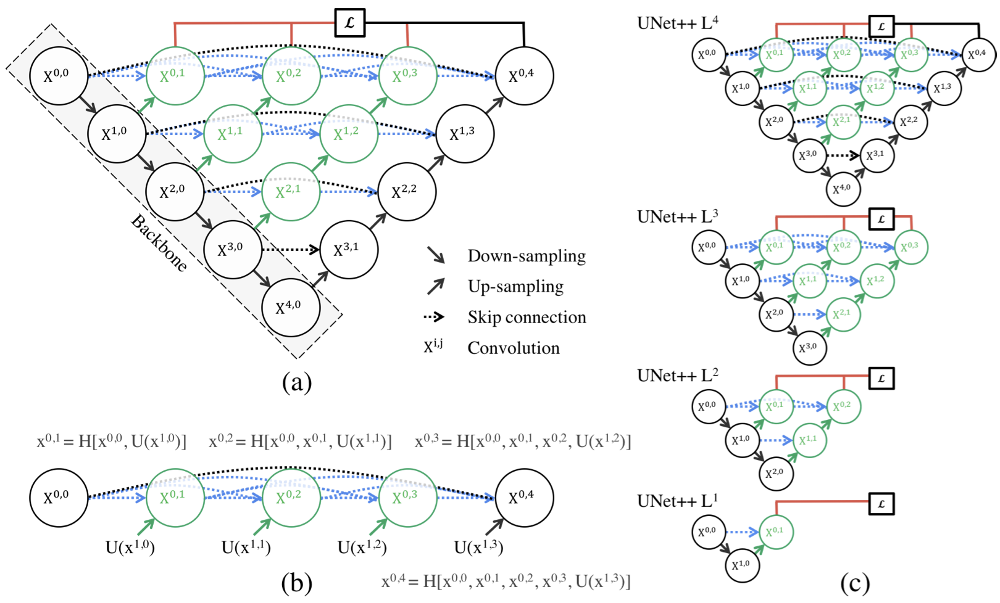

# [&larr;](../README.md) The backbone architecture

 Data-driven models can be used to understand how climate change is affecting the frequency and location of wildfire events, according to different future projection scenarios based on different socioeconomic changes.

 Different DNN architectures must be evaluated to address the various use cases, including Convolutional and Graph networks. The trained models will be used as a base for understanding how different climate scenarios can affect extreme events frequency, locations, probability, etc. Future projection data from large experiments, like the Climate Model Intercomparison Project 6th phase (CMIP6), will be used as input for the trained models. 

 The <a href="https://arxiv.org/abs/1807.10165" style="text-decoration:none;"> Unet++ </a> was chosen as the backbone architecture of the <b>first version</b> of our data-driven model to predict fire danger (burned area maps) based on future climate change projections.

 
> 
**a.** _UNet++ consists of an encoder and decoder that are connected through a series of nested dense convolutional blocks. The main idea behind UNet++ is to bridge the semantic gap between the feature maps of the encoder and decoder prior to fusion. For example, the semantic gap between ($X^{0,0}$,$X^{1,3}$) is bridged using a dense convolution block with three convolution layers. In the graphical abstract, black indicates the original U-Net, green and blue show dense convolution blocks on the skip pathways, and red indicates deep supervision. Red, green, and blue components distinguish UNet++ from U-Net._
**b.** _Detailed analysis of the first skip pathway of UNet++._
**c.** _UNet++ can be pruned at inference time, if trained with deep supervision._

